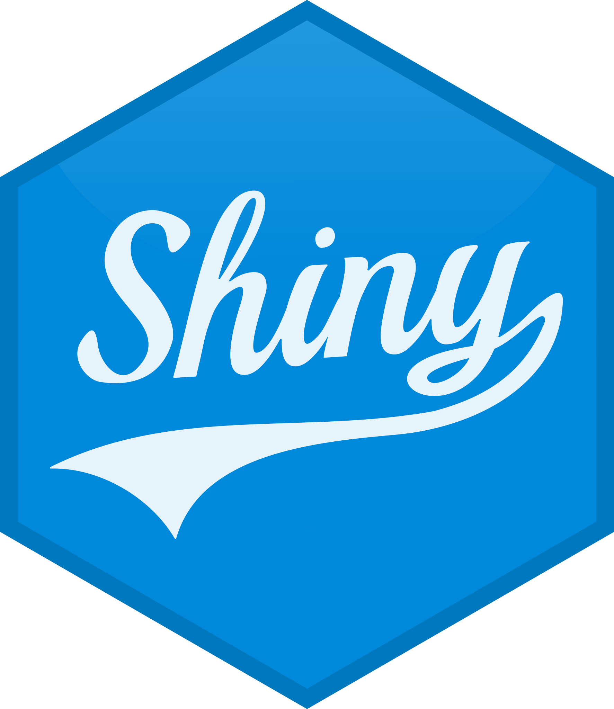
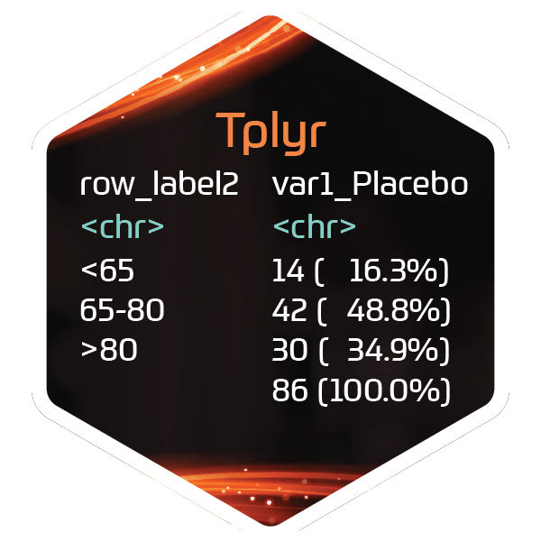
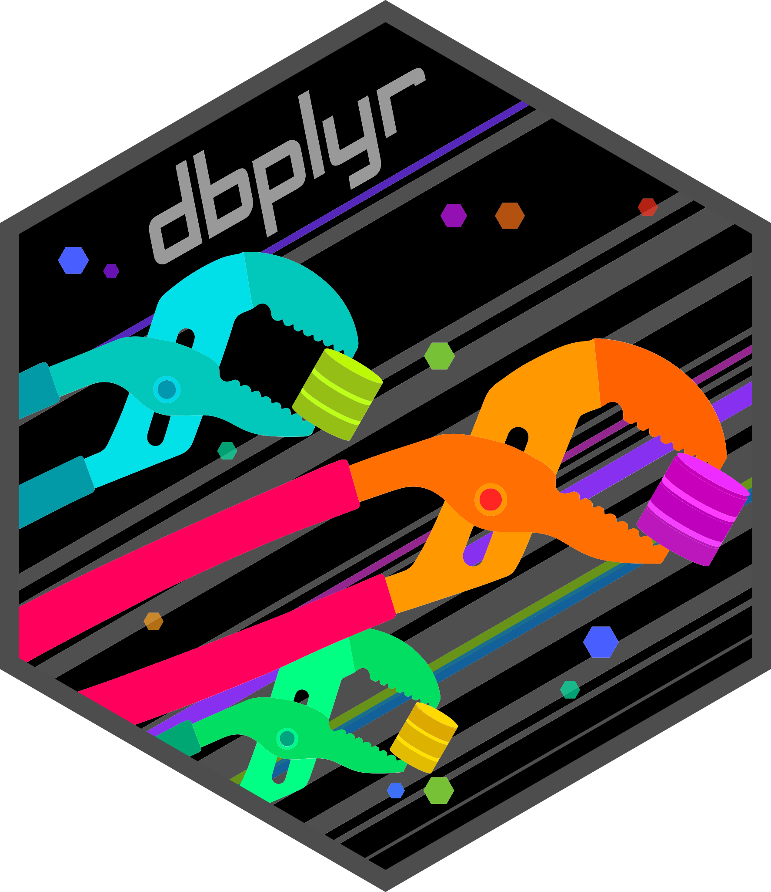
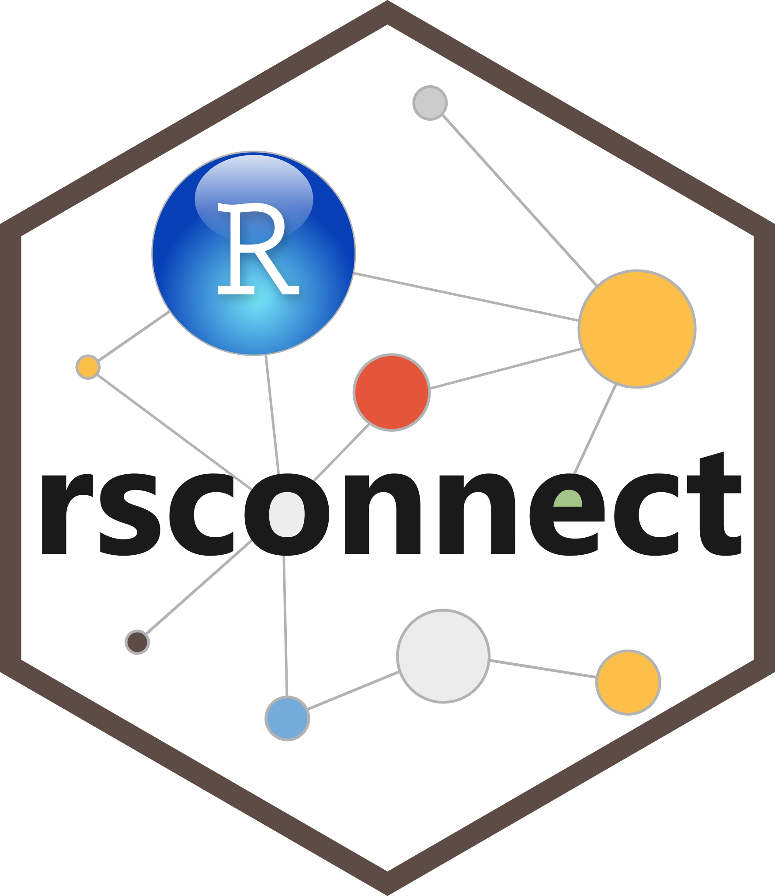
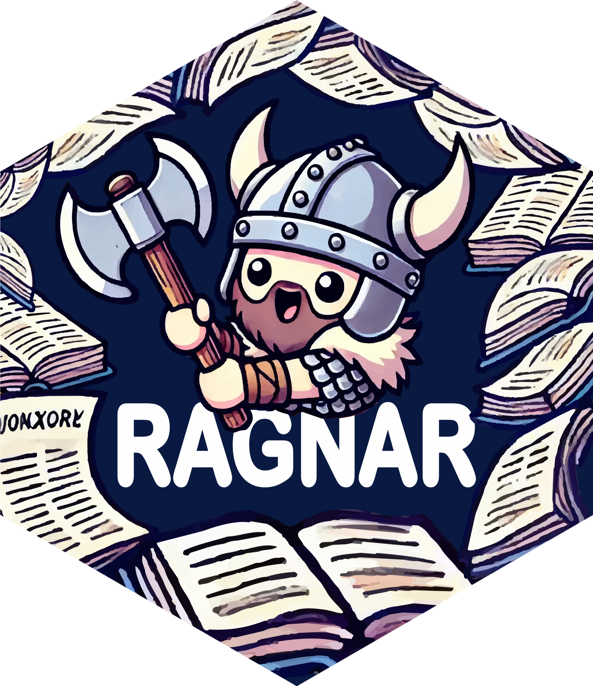

```{r setup, include=FALSE}
knitr::opts_chunk$set(
  echo = TRUE,
  fig.align = "center",
  fig.width = 8,
  fig.height = 4.5,
  dpi = 120
)
```

## {.speaker-slide}

::: {.speaker-card}

::: {.speaker-photo}
{.headshot fig-alt="Matthew Kumar"}
:::

::: {.speaker-info}

::: {.speaker-name}
Matthew Kumar
:::

::: {.speaker-title}
Associate Director, DSAI
:::

::: {.speaker-company}
Bayer
:::

::: {.speaker-links}
<a href="https://matt-kumar.netlify.com" class="speaker-link"><svg xmlns="http://www.w3.org/2000/svg" viewBox="0 0 24 24" fill="none" stroke="currentColor" stroke-width="2" stroke-linecap="round" stroke-linejoin="round" aria-hidden="true"><circle cx="12" cy="12" r="10"/><line x1="2" y1="12" x2="22" y2="12"/><path d="M12 2a15.3 15.3 0 0 1 4 10 15.3 15.3 0 0 1-4 10 15.3 15.3 0 0 1-4-10 15.3 15.3 0 0 1 4-10z"/></svg>Home</a>
<a href="https://www.linkedin.com/in/matthew-kumar-24910629/" class="speaker-link"><svg xmlns="http://www.w3.org/2000/svg" viewBox="0 0 24 24" fill="currentColor" aria-hidden="true"><path d="M20.447 20.452h-3.554v-5.569c0-1.328-.027-3.037-1.852-3.037-1.853 0-2.136 1.445-2.136 2.939v5.667H9.351V9h3.414v1.561h.046c.477-.9 1.637-1.85 3.37-1.85 3.601 0 4.267 2.37 4.267 5.455v6.286zM5.337 7.433c-1.144 0-2.063-.926-2.063-2.065 0-1.138.92-2.063 2.063-2.063 1.14 0 2.064.925 2.064 2.063 0 1.139-.925 2.065-2.064 2.065zm1.782 13.019H3.555V9h3.564v11.452zM22.225 0H1.771C.792 0 0 .774 0 1.729v20.542C0 23.227.792 24 1.771 24h20.451C23.2 24 24 23.227 24 22.271V1.729C24 .774 23.2 0 22.222 0h.003z"/></svg>LinkedIn</a>
<a href="https://github.com/mattkumar" class="speaker-link"><svg xmlns="http://www.w3.org/2000/svg" viewBox="0 0 24 24" fill="currentColor" aria-hidden="true"><path d="M12 0c-6.626 0-12 5.373-12 12 0 5.302 3.438 9.8 8.207 11.387.599.111.793-.261.793-.577v-2.234c-3.338.726-4.033-1.416-4.033-1.416-.546-1.387-1.333-1.756-1.333-1.756-1.089-.745.083-.729.083-.729 1.205.084 1.839 1.237 1.839 1.237 1.07 1.834 2.807 1.304 3.492.997.107-.775.418-1.305.762-1.604-2.665-.305-5.467-1.334-5.467-5.931 0-1.311.469-2.381 1.236-3.221-.124-.303-.535-1.524.117-3.176 0 0 1.008-.322 3.301 1.23.957-.266 1.983-.399 3.003-.404 1.02.005 2.047.138 3.006.404 2.291-1.552 3.297-1.23 3.297-1.23.653 1.653.242 2.874.118 3.176.77.84 1.235 1.911 1.235 3.221 0 4.609-2.807 5.624-5.479 5.921.43.372.823 1.102.823 2.222v3.293c0 .319.192.694.801.576 4.765-1.589 8.199-6.086 8.199-11.386 0-6.627-5.373-12-12-12z"/></svg>GitHub</a>
:::

:::

:::

::: {.notes}
Brief intro: Matthew Kumar, Associate Director in DSAI at Bayer.
:::

## Agenda {.agenda-slide}

::: {.agenda-list}
::: {.agenda-item}
Problem Space
:::
::: {.agenda-item}
Previous Work
:::
::: {.agenda-item}
New Approaches
:::
::: {.agenda-item}
Demo
:::
::: {.agenda-item}
Future
:::
:::

## Problem Space {.section-title-slide}

## Background {.background-slide .rough-notation-slide}

::: incremental
- [Early oncology]{.rn-fragment rn-type=underline rn-color="#00BCFF"} studies bring significant complexity, from novel therapies to unconventional trial designs and vulnerable patient populations
- Timely insight from emerging data is essential for high-impact development decisions
- Traditional reporting tools are often [too constrained]{.rn-fragment rn-type=underline rn-color="#00BCFF"} for exploratory or fast-changing analytical needs
- Bespoke analysis requests can create delays that are misaligned with decision timelines
- The need is for a [faster]{.bayer-blue-emphasis}, more adaptable reporting approach that still maintains rigor in a regulated environment
:::

## Previous Work {.section-title-slide}

## What we did {.what-we-did-slide .rough-notation-slide}

::: incremental
- <div class="what-we-did-row"><span>Started with a deterministic Shiny review app for baseline and efficacy exploration</span></div>

- <div class="what-we-did-row"><span>Added an experimental LLM layer based on <span class="bayer-blue-emphasis">querychat</span> for natural-language filtering and data analysis</span></div>

- <div class="what-we-did-row"><span>Developed <span class="bayer-blue-emphasis">ellmer tools</span> to create novel figures and tables (with R code returned) and one-click interpretation of standard plots</span><span class="what-we-did-hex-group"></span></div>

- <div class="what-we-did-row"><span>A [complementary]{.rn-fragment rn-type=underline rn-color="#00BCFF"} approach worked well: a Shiny foundation for reliable review, with the LLM accelerating exploration and driving insight in the last mile</span><span class="what-we-did-check" aria-hidden="true">✓</span></div>

- <a href="https://phuse.s3.eu-central-1.amazonaws.com/Archive/2026/Connect/US/Austin/PAP_ML20.pdf" class="paper-link">PHUSE US Connect 2026 paper<svg xmlns="http://www.w3.org/2000/svg" viewBox="0 0 24 24" fill="none" stroke="currentColor" stroke-width="2" stroke-linecap="round" stroke-linejoin="round" aria-hidden="true"><circle cx="12" cy="12" r="10"/><line x1="2" y1="12" x2="22" y2="12"/><path d="M12 2a15.3 15.3 0 0 1 4 10 15.3 15.3 0 0 1-4 10 15.3 15.3 0 0 1-4-10 15.3 15.3 0 0 1 4-10z"/></svg></a>
:::

## What we learned {.what-we-learned-slide .rough-notation-slide}

::: incremental
- Users generally liked the LLM features, especially plot interpretation as a quick "second set of eyes"
- Reception was [mixed]{.rn-fragment rn-type=underline rn-color="#FF3162"}: some users were less comfortable with open-ended AI generation
- For some reviewers, a full Shiny app [was more]{.rn-fragment rn-type=underline rn-color="#FF3162"} than they needed; they already knew the exact views they wanted
:::

::: {.fragment .llm-thinking-wrap}
<span class="llm-thinking">Thinking...</span>
:::

::: incremental
- A [simpler]{.rn-fragment rn-type=underline rn-color="#00BCFF"} path: a static [scheduled]{.rn-fragment rn-type=underline rn-color="#00BCFF" rn-animate="true" rn-animationduration="600"} report with fixed visuals, plus LLM insights, [delivered]{.rn-fragment rn-type=underline rn-color="#00BCFF" rn-animate="true" rn-animationduration="600"} to the reviewer inbox
:::

## New Approaches {.section-title-slide}

## Data Process {.workflow-slide .rough-notation-slide .process-i}

::::: {.process node-color="#00BCFF"}

:::: item
Quarto on Connect

::: annotation
[Scheduled Quarto doc]{.rn-fragment rn-type=highlight rn-color="#00BCFF"} lives and runs on Posit Connect

{height="52px"}
:::

::::

:::: item
Query Data

::: annotation
[Queries]{.rn-fragment rn-type=highlight rn-color="#00BCFF"} the SQL warehouse for the most recent oncology trial data

{height="52px"}
:::

::::

:::: item
Save as Pin

::: annotation
[Saves]{.rn-fragment rn-type=highlight rn-color="#00BCFF"} results to Posit Connect as a versioned Pin dataset

{height="52px"}
:::

::::

:::: item
Report data ready

::: annotation
[Primary use]{.rn-fragment rn-type=highlight rn-color="#00BCFF"} feeds a second scheduled Quarto report on Connect

[Secondary uses]{.rn-fragment rn-type=highlight rn-color="#00BCFF"} include ad hoc analysis and additional reporting

:::

::::

:::::

::: {.notes}
Walk through left to right: a Quarto document scheduled on Posit Connect queries the SQL warehouse, snapshots the result as a Pin, and that Pin becomes the single source of truth consumed by the downstream report and available for secondary uses.
:::

## Report Process {.workflow-slide .rough-notation-slide .process-ii}

::::: {.process node-color="#00BCFF"}

:::: item
Read Pin

::: annotation
[Quarto report]{.rn-fragment rn-type=highlight rn-color="#00BCFF"} reads the pinned dataset from Connect

<div style="display:flex;align-items:center;gap:8px;justify-content:center;margin-top:6px;">

<svg width="38" height="16"><line x1="0" y1="8" x2="30" y2="8" stroke="#2e6b8a" stroke-width="1.5" stroke-dasharray="4 3"/><polygon points="30,4 38,8 30,12" fill="#2e6b8a"/></svg>

</div>
:::

::::

:::: item
Build visuals

::: annotation
[Quarto renders]{.rn-fragment rn-type=highlight rn-color="#00BCFF"} oncology charts, graphs, and tables from the pin data
:::

::::

:::: {.item color="#FF3162"}
LLM interprets

::: annotation
[ellmer sends]{.rn-fragment rn-type=highlight rn-color="#FF3162"} chart images to the internal LLM service for narrative interpretation

{height="52px"}
:::

::::

:::: item
Render report

::: annotation
[Interpretation returned]{.rn-fragment rn-type=highlight rn-color="#00BCFF"}, woven into the Quarto document and stored on Connect. Source published, previous reports accessible

<div style="display:flex;align-items:center;gap:8px;justify-content:center;margin-top:6px;">

<svg width="38" height="16"><line x1="0" y1="8" x2="30" y2="8" stroke="#2e6b8a" stroke-width="1.5" stroke-dasharray="4 3"/><polygon points="30,4 38,8 30,12" fill="#2e6b8a"/></svg>

</div>
:::

::::

:::: item
Email to users

::: annotation
[Report e-mailed automatically]{.rn-fragment rn-type=highlight rn-color="#00BCFF"} to users on schedule

{height="44px"}
:::

::::

:::::

::: {.notes}
Walk through left to right: the scheduled content report reads the pinned data from Connect, builds the oncology visuals, calls the internal LLM API via ellmer to generate narrative interpretation, weaves that text into the rendered document, then emails it to end users.
:::

## LLM Process {.workflow-slide .zoom-in-slide .rough-notation-slide .process-iii}

::: {.zoom-in-pipeline}

::: {.zoom-port .zoom-port-lead}
<span class="zoom-dots" aria-hidden="true"><i></i><i></i><i></i></span>
<div class="arrow-shape"></div>
:::

::::: {.process node-color="#00BCFF"}

:::: {.item color="#89D329"}
Study documents

::: annotation
[Ragnar processes]{.rn-fragment rn-type=highlight rn-color="#89D329"} study documents (e.g. CSP, SAP, IDRP) and others into context

[Saves context]{.rn-fragment rn-type=highlight rn-color="#89D329"} in a reusable vector store (DuckDB)

{height="52px"}
:::

::::

:::: {.item color="#FF3162"}
LLM interprets

::: annotation
ellmer sends chart images to the internal LLM service for narrative interpretation; [study information provided as context]{.rn-fragment rn-type=highlight rn-color="#FF3162"}

<div style="display:flex;align-items:center;gap:8px;justify-content:center;margin-top:6px;">

<svg width="32" height="16" viewBox="0 0 32 16" aria-hidden="true"><line x1="7" y1="8" x2="25" y2="8" stroke="#2e6b8a" stroke-width="1.5" stroke-dasharray="4 3"/><polygon points="0,8 7,4 7,12" fill="#2e6b8a"/><polygon points="32,8 25,4 25,12" fill="#2e6b8a"/></svg>

</div>
:::

::::

:::: item
Render report

::: annotation
[Richer interpretations returned]{.rn-fragment rn-type=highlight rn-color="#00BCFF"}, grounded in study context

<div style="display:flex;align-items:center;gap:8px;justify-content:center;margin-top:6px;">

<svg width="38" height="16"><line x1="0" y1="8" x2="30" y2="8" stroke="#2e6b8a" stroke-width="1.5" stroke-dasharray="4 3"/><polygon points="30,4 38,8 30,12" fill="#2e6b8a"/></svg>

</div>
:::

::::

:::::

::: {.zoom-port .zoom-port-trail}
<div class="arrow-shape"></div>
<span class="zoom-dots" aria-hidden="true"><i></i><i></i><i></i></span>
:::

:::

::: {.notes}
The LLM step pulls in study documents (protocol/CSP, SAP, IDRP, and others via Ragnar), and ellmer sends chart images to the internal LLM service with that study information as context. The report is then rendered on Connect and emailed to users as before.
:::


## Demo {.demo-slide}

[Click here to view report](https://mattkumar.github.io/genai_day_2026/beacon-01.html)

::: {.notes}
Open the linked rendered report (beacon-01.html) hosted with this deck on GitHub Pages.
:::

## Human In The Loop (HIL)? {.section-title-slide}

## Future {.section-title-slide}

## Directions {.directions-slide .rough-notation-slide}

::: incremental
- Most of this experiment is for [feasibility]{.rn-fragment rn-type=box rn-color="#00BCFF" rn-animate="true" rn-animationduration="600"}

- Continue the journey by refining the pipeline, prompts, and guardrails as we learn

  - [**vitals**](https://vitals.tidyverse.org) is a framework for evaluating LLM outputs with ellmer
  - Systematic prompt comparisons, model grading, and inspectable eval logs

- Explore [**pins**](https://pins.tidyverse.org) storage backends, including **AWS S3 buckets**

- Embed prior reports in the RAG process to surface the delta and journey of issues, findings, and insights over time

- Onboard new users to gauge receptiveness and gather further feedback
:::

::: {.notes}
Future work: iterate on prompts and process using vitals evals, expand the user base for feedback, and enrich Ragnar context with historical reports so narratives can reference how findings evolved.
:::

## Thank you {.section-title-slide}

